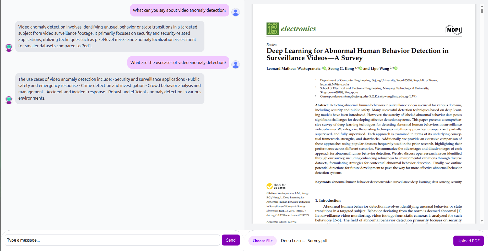
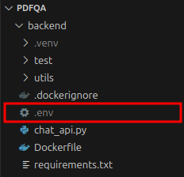
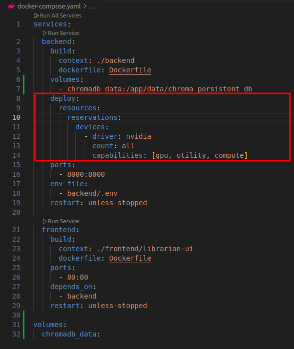

# pdfQA
Q&A system for PDF files using lightweight local LLMs, vector search, and an Angular frontend. Includes full pipeline from document ingestion to answer generation, with FastAPI and Docker support.

## 🚀 Features

- 💬 **LLM-Powered Chat:** Interact with a large language model for instant Q&A and conversation.
- 📄 **PDF Upload & Preview:** Upload PDF files and preview them directly in the browser.
- 🔍 **PDF Querying:** Ask questions about the uploaded PDF and receive contextual answers.
- 🎯 **Clean UI:** Minimal and responsive interface for easy interaction.


## 📸 Screenshots

<table>
<tr>
<td></td>
</tr>
<tr>
<td></td>
</tr>
</table>

## 📋 Requirements

To run the application, make sure you have the following:

- 🐳 Docker
- 🤗 Hugging Face API token

## 🛠️ Installation

Follow these steps to install and run the project:

1. Clone the repository:
    ```bash
    git clone https://github.com/mfatihp/pdfQA.git
    ```
2. Navigate to the project backend directory:
    ```bash
    cd pdfQA/backend/
    ```
3. Create a `.env` file in the `backend` folder and add your 🤗 Hugging Face token as:
    ```bash
    HF_TOKEN="your_huggingface_token_here"
    ```

    <p align="center">
    
    </p>

4. Navigate back to the project root directory:
    ```bash
    cd ..
    ```

5. **(Optional)** If you do not want the GPU support, you may delete the marked code block from `docker-compose.yaml` file.

<p align="center">

</p>

6. Build and run the Docker container. If you don’t require GPU support, you can omit `sudo`:
    ```bash
    sudo docker compose up --build
    ```

## 📈 How To Use

1️⃣ Open your browser and navigate to [http://localhost:80](http://localhost:80).

2️⃣ Click the `Choose file` button to select the PDF you want to upload.

3️⃣ If you would like to add the file to the LLM database for querying, click the `Upload` button.

4️⃣ Once uploaded, start chatting with the bot to ask questions about your PDF.


## ⚠️ Troubleshooting

Below are common issues you may encounter during installation and their solutions.

### **Missing Dependencies (GPU Support)**

Ensure you have installed the following packages if you want GPU support:

- nvidia-container-toolkit (for GPU support)
- nvidia-docker2 (for GPU support)

